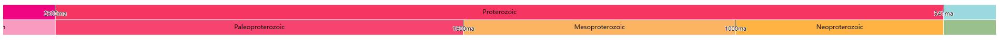

# geo-timeline

A D3.js(v7) based geologic timeline


- ``Zoom:`` Use the mouse wheel to control zoom, double-click to zoom in.
- ``Adjustment:`` Hold down the left button to drag the timeline.
- ``Location:`` Left click the timeline to move the handler quickly, or drag to move the handler.

A D3.js(v7) based geologic timescale



- ``Location:`` Left click the geo stage to quick location.
- ``Zoom:`` Use the mouse wheel to control zoom in or zoom out.

## Install

For node.js

```bash
#npm
npm install --save @zjugis/geo-timeline
#yarn
yarn add @zjugis/geo-timeline
```

Or in a browser

```html
<script src="//unpkg.com/@zjugis/geo-timeline@latest"></script>
```

### Usage

For node.js

```ts
import { GeoTimeLine, GeoTimeScale } from "@zjugis/geo-timeline";

// create geotimeline obj
const geoTimeLine = new GeoTimeLine("#geoTimeContainer", {
  onChange: function(time, level) {
    // do something
  },
  // determin interval by time
  intervalSum: d => d.leaf ? d.start - d.end : 0
});

// It is recommended to set the time after changing the level
geoTimeLine.level = 2
geoTimeLine.time = 2000

// create geotimescale obj
const geoTimeScale = new GeoTimeScale("#geoTimeScale-simple", {
  onChange: val => console.log(val),
  // only show 2 levels once
  simplify: true,
  height: 70,
})
// set stage
geoTimeScale.stage = 'Cambrian'
```

Or in a browser

```js
new timeLine.GeoTimeLine("#geoTimeLineContainer");
new timeLine.GeoTimeScale("#geoTimeScaleContainer");
```

### API

#### GeoTimeLine

```ts
class GeoTimeLine {
    /** text font */
    readonly font: string;
    /** interval data's max level */
    readonly maxLevel: number;
    /** svg object */
    readonly svg: Selection<SVGSVGElement, unknown, HTMLElement, any>;
    /** interval data */
    readonly intervals: IntervalItem[];
    /** hierarchical data generated by intervals */
    readonly hierarchicalData: HierarchyNode<IntervalItem>;
    /** the root hierarchical data */
    readonly root: NodeItem;
    /** user input options */
    readonly options: GeoTimeLineOptions
    
    /** 
     * Create a GeoTimeLine
     * @param selector CSS selector string
     * @param options GeoTimeLine options
    */
    constructor(selector: string, options?: GeoTimeLineOptions);

    /** get or set time */
    get time(): number;
    set time(val: number);
    /** get or set level */
    get level(): number;
    set level(val: number);
}

interface GeoTimeLineOptions {
    /** svg width, defaults to container's width */
    width?: number;
    /** svg height, defaults to 70 */
    height?: number;
    /** font size, defaults to 16px */
    fontSize?: number;
    /** font family, defaults to 'sans-serif' */
    fontFamily?: string;
    /** callback when handle's position or scale level changed */
    onChange?: (time: number, level: number) => void;
    /** dispatch when mouseup or zoom  */
    onAfterChange?: (time: number, level: number) => void;
    /** geo time intervals array */
    intervals?: IntervalItem[];
    /** defaults to {
      top: 0, right: 0, bottom: 0, left: 0,
    } */
    margin?: {
        top?: number;
        bottom?: number;
        left?: number;
        right?: number;
    }
    /** defaults to {
      top: 0, right: 0, bottom: 0, left: 0,
    } */
    padding?: {
        top?: number;
        bottom?: number;
        left?: number;
        right?: number;
    }
    /** initial time, defaults to 0 */
    time?: number;
    /** animation time, defaults to 450ms */
    transition?: number;
    /** interval transform setting, defaults to (d) => d.leaf ? 1 : 0 */
    intervalSum?: (d: IntervalItem) => number;
    /** min zoom level */
    minZoom?: number;
    /** max zoom level, defaults to 10 */
    maxZoom?: number;
}

/** geo time data intervals schema **/
type IntervalItem = {
    id: number;
    name: string;
    abbr?: string;
    color: string;
    textColor?: string;
    end: number;
    start: number;
    level?: number;
    parentId?: number;
    leaf?: boolean;
}

```

#### GeoTimeScale 

```ts
class GeoTimeLine {
    /** text font */
    readonly font: string;
    /** svg object */
    readonly svg: Selection<SVGSVGElement, unknown, HTMLElement, any>;
    /** interval data */
    readonly intervals: IntervalItem[];
    /** hierarchical data generated by intervals */
    readonly hierarchicalData: HierarchyNode<IntervalItem>;
    /** the root hierarchical data */
    readonly root: NodeItem;
    /** user input options */
    readonly options: GeoTimeScaleOptions;
    /** get or set animation transition time */
    transition: number;
    constructor(selector: string, options?: GeoTimeScaleOptions);
    /** get or set focused stage
     * @example
     * geoTimeScale.stage = 'Cambrian'
     */
    get stage(): string;
    set stage(val: string);
    get sequence(): NodeItem[];
}
interface GeoTimeScaleOptions {
    /** svg width, defaults to container's width */
    width?: number;
    /** svg height, defaults to 400px */
    height?: number;
    /** font size, defaults to 12px */
    fontSize?: number;
    /** font family, defaults to 'sans-serif' */
    fontFamily?: string;
    /** callback when handle's position or scale level changed */
    onChange?: (node: NodeItem) => void;
    /** geo time intervals array */
    intervals?: IntervalItem[];
    /** defaults to {
      top: 0, right: 0, bottom: 0, left: 0,
    } */
    margin?: MarginOpts;
    /** defaults to {
      top: 0, right: 0, bottom: 0, left: 0,
    } */
    padding?: MarginOpts;
    /** animation time, defaults to 450ms */
    transition?: number;
    /** interval transform setting, defaults to d => d.leaf ? d.start - d.end : 0 */
    intervalSum?: (d: IntervalItem) => number;
    /** show all levels or not, defaults to false */
    simplify?: boolean;
    /** focused node's neighbor node width, defaults to 100px */
    neighborWidth?: number;
    /** tick length, defaults to 15px */
    tickLength?: number;
}
```

## Custom data

The interval item's schema like follow:

```json
{
  "id": 753,
  "name": "Archean",
  "level": 1,
  "parentId": 0,
  "color": "#F0047F",
  "end": 2500,
  "start": 4000
}
```

## Demo

[Online demo](https://geo-timeline.vercel.app/)

## Develop

Run the command:

```bash
npm run dev
```

And then Launch [index.html](index.html) with node server, if use VS Code, suggest the ``Live Server`` extension.

## Credit

<https://github.com/UW-Macrostrat/geo-timescale>
